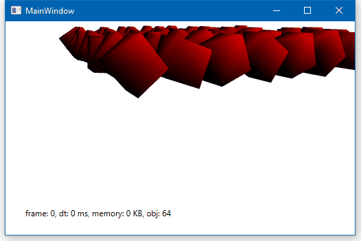

# Qu3e-Sharp

Qu3e-Sharp is a unofficial C# ported version of RandyGaul's [Qu3e Physics Engine](https://github.com/RandyGaul/qu3e)

The aim for this repository is to provide an easy library for those who need a simple physics engine that run using C# back-end. The product of this repository is a managed, portable library that independent of any reference (other than mscorlib.dll) so it can be used by many programs with C# back-ends like .NET Core, XNA, Unity, etc.

## Changes

C# has different environment than C++ in many areas so it's impossible to port with 100% exact implementation. However the aim is same: Simple and efficient.

The latest version of this repository is based from the original repo version 1.01.

Changes that make this repository different than the original:

#### Naming convention:

- Removed all former-name 'q3' in every file, functions and classes
- All classes and structs is in a namespace 'Qu3e'
- All public variables is capitalized with PascalCase

#### Value types:

- Double precision is used for all 'r32' values

#### Built-in Libraries & Referencing styles:

- Changed (nearly) all std math functions to System.Math
- (nearly) all arrays, including linked classes are replaced with List<T>
- Common/Settings.cs is a special static class and the rest of code is referencing it by 'using static' (C# 6.0 feature), therefore some static functions also moved there.
- Removed Scene Dumping

#### Caching and memory Management:

- Memory management is handled differently (See Common/Memory)
- All temporary arrays inside functions are moved out to prevent memory garbage.
- Island variable inside Step() in Scene is no longer be a temporary variable
- Because of frequent allocations, ContactState and ContactConstraintState has it's own memory management inside it's own class.

## Additional Features

This repository does also and will made some improvement outside the original. Some features of that include:

- Variable delta time
- Sphere & Capsule Collision
- Algorithm necessary for Convex collisions

Note that this doesn't mean I won't contribute anything back to the original. If you want to contribute, consider to do that in original repo if you can write C++.

## Demo

This repository has a demo in WPF application. The demo doesn't implement Common/Render.cs.

## More Information

See the [original repo](https://github.com/RandyGaul/qu3e) for more instructions.